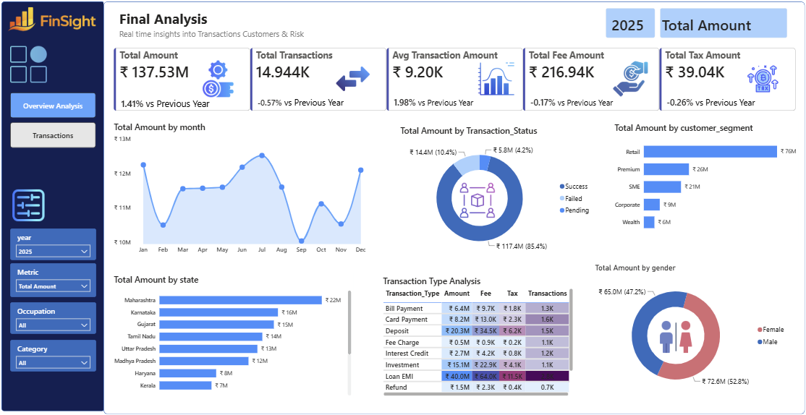
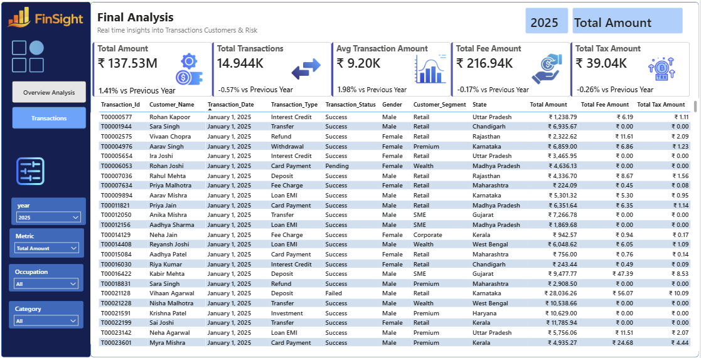

# Project 1: Finance Analytics Dashboard

[⬅ Back to Portfolio](../README.md)

---

## 📊 Overview
An interactive Power BI dashboard ("FinSight") built to meet a financial organization's business requirements for monitoring transactions, customer behavior, fees, taxes, and transaction performance across business segments and regions. The report is split into two pages — an **Overview Analysis** page for high-level KPIs and trends, and a **Transactions** page with a detailed, drillable transaction grid.

## 📄 Business Requirements
Full requirements are in [`docs/Business-Requirements.docx`](./docs/Business-Requirements.docx). Summary:
- Monitor overall transaction growth/performance, monthly trends, and success vs. failed transactions
- Analyze customer segment contribution, state-wise performance, transaction type profitability, and gender-based participation
- Track Year-over-Year (YoY) performance changes, operational fees, and taxes
- Support dynamic filtering by Year, Dynamic Measure, Occupation, and Category
- Provide a second, detail-grid dashboard for drill-down into underlying transaction records

## 🖼️ Reports

*Overview Analysis — KPI cards (Total Amount, Transactions, Fees, Tax, Avg Transaction Value) with YoY change, monthly trend, status/gender donuts, segment/state bars, and a transaction-type matrix*

*Transactions — detailed, filterable grid for drilling into individual transaction records*

## 🛠️ Project Details
- Modeled the transaction fact table against the customer dimension table (relationship on `customer_id`) to enable segment, demographic, and geographic breakdowns
- Built DAX measures for the core KPIs: Total Amount, Total Transactions, Average Transaction Value, Total Fees, and Total Tax, each with YoY growth comparisons
- Designed KPI cards with icon visuals, and charts per the requirements: a line/area chart for monthly amount trends, donut charts for transaction status and gender split, horizontal bar charts for customer segment and state performance, and a matrix/heatmap table for transaction-type profitability (amount, fees, tax, count)
- Added slicers for Year, Dynamic Measure, Occupation, and Category to support dynamic filtering
- Built a second report page ("Transactions") with a detailed, filterable grid for drill-down into individual transaction records

## 💡 Key Insights
- **Success rate is high but not universal:** 85.8% of transactions succeed (42,930 of 50,069); 10.2% fail and 4.1% are pending — a meaningful chunk of volume worth investigating for operational or channel-specific causes.
- **Loan EMI and Transfers dominate volume:** Loan EMI (9,140) and Transfer (8,479) are the two most frequent transaction types, together accounting for roughly a third of all transactions.
- **Customer base skews Retail:** 54% of customers (2,703 of 5,000) sit in the Retail segment, followed by Premium (895) and SME (780) — Corporate and Wealth are the smallest but likely highest-value segments per customer.
- **Gender split is balanced:** customers are nearly evenly split between Female (2,544) and Male (2,456), so demographic differences in transaction behavior are unlikely to be driven by sample imbalance.
- **Channel usage is broadly diversified:** transaction volume is spread fairly evenly across Branch, UPI, ATM, Net Banking, POS, and Auto Debit (~7,100–7,200 each), with Mobile App slightly behind — worth watching if mobile adoption is a business goal.

## 🗂️ Dataset
**`Customer-Data.csv`** — 5,000 customer records, 11 fields:
- **Demographics:** gender, date_of_birth, city, state (13 states), occupation (Retired, Student, Salaried, Self Employed, Freelancer, Business Owner)
- **Profile:** customer_segment (Retail, Premium, SME, Corporate, Wealth), annual_income, join_date

**`Finance-Transactions-Data.csv`** — 50,069 transaction records, 15 fields:
- **Transaction details:** transaction_date, account_id, customer_id, transaction_type (Bill Payment, Card Payment, Deposit, Fee Charge, Interest Credit, Investment, Loan EMI, Refund, Transfer, Withdrawal), channel (Mobile App, UPI, ATM, Net Banking, POS, Branch, Auto Debit), merchant_category
- **Financials:** amount, fee_amount, tax_amount, currency
- **Status & risk:** transaction_status (Success, Failed, Pending), is_fraud, risk_score

## 📂 src / data / docs
- `src/Finance-Analytics-Dashboard.pbix` — the Power BI report file (open in Power BI Desktop)
- `src/assets/` — icon and logo images embedded in the report visuals (KPI card icons, FinSight logo, filter/menu icons)
- `data/Finance-Transactions-Data.csv` — transaction fact table
- `data/Customer-Data.csv` — customer dimension table
- `docs/Business-Requirements.docx` — original business requirements document

## ⚙️ Technologies Used

Data Modeling (fact/dimension relationship), KPI cards, YoY DAX calculations

---

Part of the [Data Analytics Portfolio](../README.md)

