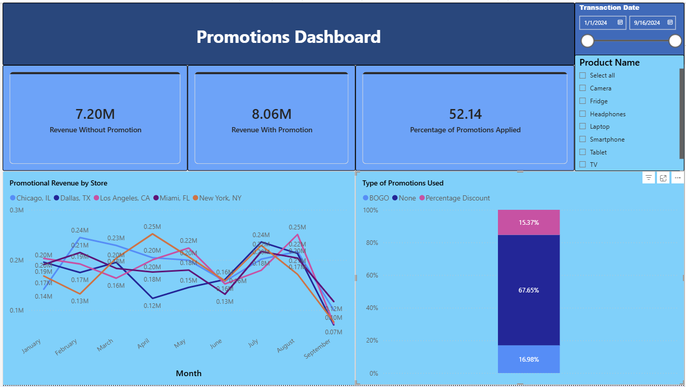

# Project 3: Promotions Dashboard

[⬅ Back to Portfolio](../README.md)

---

## 📊 Overview
A multi-page Power BI dashboard built during a professional training course to measure the impact of promotions on retail revenue, using Walmart order data. It compares revenue with vs. without promotions and breaks performance down by store, month, and promotion type.

## 🖼️ Reports

*Promotions Dashboard — revenue comparisons with and without promotions, segmented by month and store*

## 🛠️ Project Details
- Built DAX measures comparing revenue scenarios with and without promotions applied
- Designed a multi-page report: KPI cards for revenue comparison, a 100% stacked column chart of revenue by month and store, and a line chart of revenue trends over time
- Added slicers for promotion type and promotion usage to enable interactive filtering

## 💡 Key Insights & Recommendations
- **Promotions correlate with higher total revenue, but the per-transaction lift is modest:** 52.1% of transactions had a promotion applied. Total revenue from promoted transactions ($8.06M) was ~12% higher than non-promoted ($7.20M), but average revenue *per transaction* was only ~2.8% higher ($3,092.60 vs $3,009.27) — the total revenue gap is driven more by promotion frequency than by significantly larger basket sizes.
- **Store performance is fairly even, with Los Angeles leading:** Los Angeles ($3.28M) is the top-revenue store location, narrowly ahead of Chicago ($3.16M), with all five stores within ~11% of each other.
- **Recommendation:** since promotions show only a small basket-size lift, evaluate whether current promotion types (BOGO, Percentage Discount) are the right lever — testing higher-value or loyalty-targeted promotions may drive a larger increase in average order value rather than just transaction volume.

## 🗂️ Dataset
The dataset contains retail transaction records with 28 fields, including:
- **Transaction info:** transaction_id, transaction_date, product_id, product_name, category, quantity_sold, unit_price
- **Store/supplier info:** store_id, store_location, supplier_id, supplier_lead_time, inventory_level, reorder_point, reorder_quantity
- **Customer info:** customer_id, customer_age, customer_gender, customer_income, customer_loyalty_level, payment_method
- **Promotion info:** promotion_applied, promotion_type
- **Demand/context:** weather_conditions, holiday_indicator, weekday, stockout_indicator, forecasted_demand, actual_demand

> Note: the dashboard itself focuses on the promotion and revenue-related fields; the dataset also contains supply-chain fields (inventory, demand forecasting) not used in this particular report.

## 📂 src / data
- `src/Promotions-Dashboard.pbix` — the Power BI report file (open in Power BI Desktop)
- `data/Walmart-Orders-Data.csv` — source dataset of Walmart retail transactions

## ⚙️ Technologies Used

Data Visualization (KPI cards, stacked column chart, line chart) · CSV source data

---

Part of the [Data Analytics Portfolio](../README.md)

