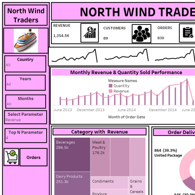
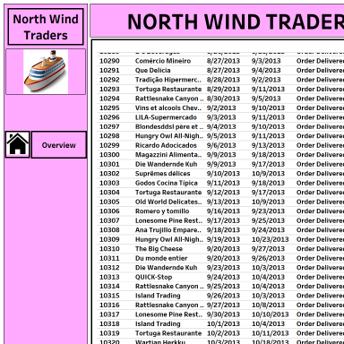
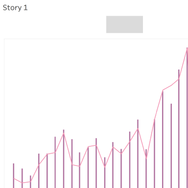

# Project 4: Sales Performance Dashboard (Northwind Traders)

[⬅ Back to Portfolio](../README.md)

---

## 📊 Overview
An interactive Tableau sales performance dashboard built during a professional training course, using the Northwind Traders orders dataset. It tracks core sales KPIs with trend analysis and includes a parameter-driven Top N view for identifying leading customers and products.

## 🖼️ Reports

The workbook contains two dashboards and a story combining multiple views:

*Main Dashboard — Revenue, Orders, Customers, Avg Discount, and Avg Shipping KPIs with trend lines*

*Orders Dashboard — Top N Customers/Products (parameter-driven), donut chart, tree map, and subcategory breakdown*

*Story view combining the dashboards into a single narrative*

> Note: these are workbook thumbnail previews extracted from the Tableau file. For higher-resolution images, open the workbook in Tableau Desktop/Public and export each dashboard directly.

## 📂 src / data
- `src/Sales-Performance-Dashboard.twbx` — the packaged Tableau workbook (open in Tableau Desktop or Tableau Public)
- `data/Northwind-Traders-Data.xlsx` — source dataset (Orders sheet)

## 🗂️ Dataset
The Northwind Traders "Orders" dataset is a classic sample e-commerce dataset with fields including:
- **Order info:** orderID, customerID, employeeID, order date, shipped date
- **Product/pricing:** product details, unit price, quantity, discount
- **Shipping:** freight/shipping cost, ship country

## 🛠️ Project Details
- Connected to and structured the Northwind Traders dataset for analysis in Tableau
- Built KPI views with trend lines for Revenue, Orders, Customers, Average Discount, and Average Shipping
- Created a dynamic Top N Customers/Products view using parameters, allowing users to adjust the number of results shown and switch between Revenue and Quantity
- Designed supporting visuals — donut chart, tree map, combination chart, and text table — to break down performance by subcategory
- Combined multiple views into two dashboards and a Tableau Story for a cohesive, presentable analysis

## ⚙️ Technologies Used

Parameters · KPI Design · Trend Analysis · Top-N Analysis · Dashboards & Storyboards

---

© 2026 [Your Name] · Part of the [Data Analytics Portfolio](../README.md) · [MIT License](../LICENSE)
